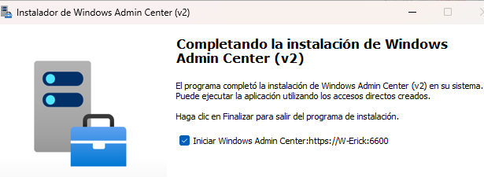
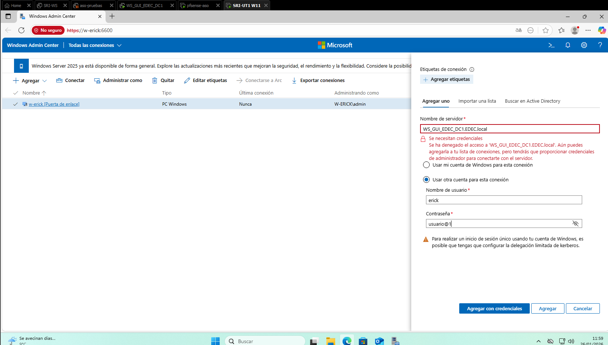
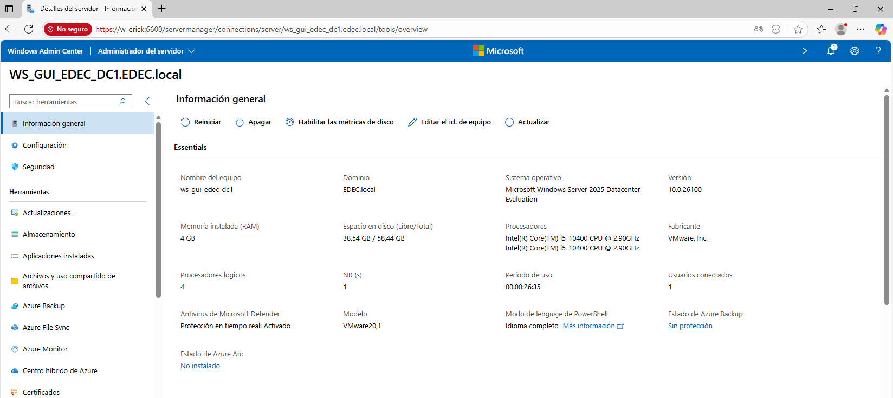
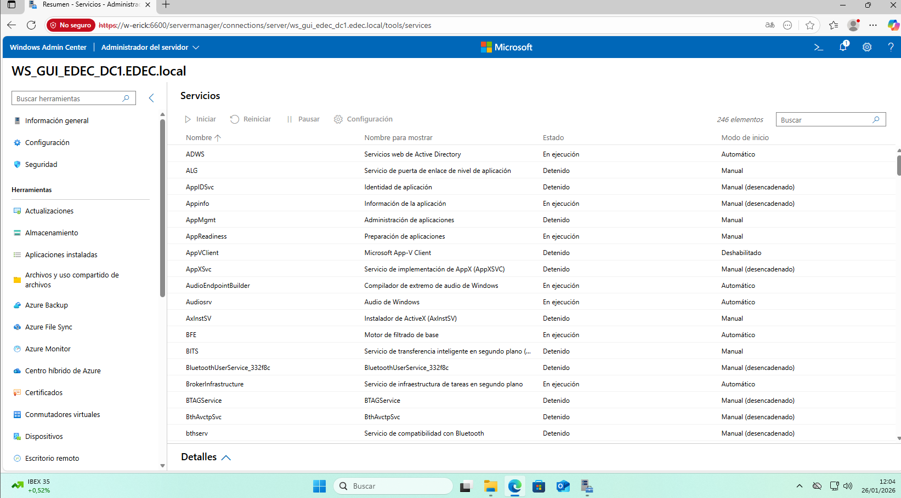
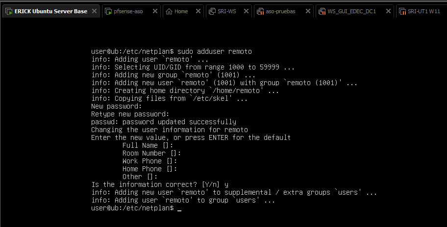
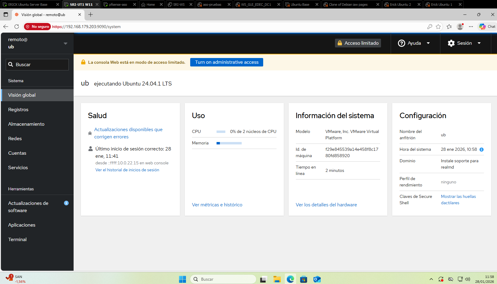

# PARTE 1

La finalidad de esta apartado será implementar la aplicación "administración remota de Windows Server" (WAC) en un cliente Windows 11, con ella obtendremos los daton en tiempo real del Windows Server, a través de los siguientes pasos:

## 1. Acceso a Windows Admin Center
Instalamos WAC

Puerto :6600

Accedemos a la aplicación a través del punto de acceso, este nos llevará automáticamente en el navegador a https:/nombredelw11:6600 
(otra opción para entrar a través del navegador es: https:/localhost:6600)
Iniciamos sesión con un usuario local

Y ya estamos dentro

## 2. Administración remota del Windows Server

Lo agregamos manualmente

### Información del sistema:

### CPU y memoria

### Servicios

# PARTE 2

La finalidad de esta apartado será implementar el servicio de monitorización web "cockpit" en un ubuntu server, el cual entraremos a través de clientes remotos (Windows11 en este caso), siguiendo los siguientes pasos:

## 1. Comprobación del servicio Cockpit

Instalamos el servicio y comprobamos que este activo
Puerto :9090

## 2. Creación de usuario remoto para administración

## 3. acceso remoto desde windows 11

Y hemos entrado

